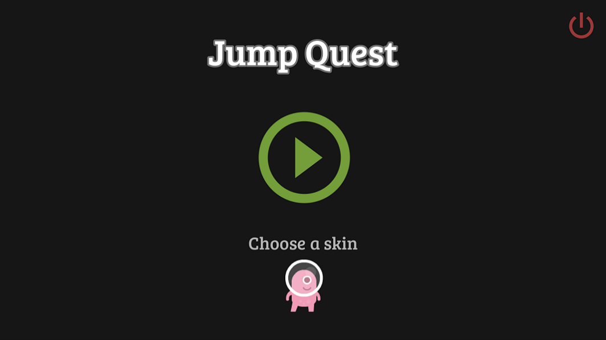

# Jump_Quest

This project is a 2D Platforming game made with the Godot engine. Using the brutal obstacle courses from Maplestory as inspiration, Jump Quest is difficult, but rewarding. Avoid obstacles, enemies and conquer the terrain to achieve victory! The dynamic movement and physics provide the player with an fun and fluid experience. The project is still in its infancy, but progress is being made, and any feedback would be greatly appreciated!

Playable build available online at: https://shaiyon.com/Jump_Quest.html

~shaiyon 

